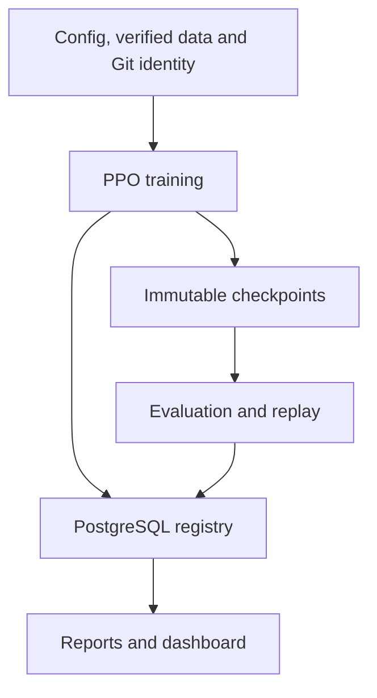

# PPO_AGENT

Research infrastructure for training, evaluating, comparing and reproducing PPO
trading agents on historical market data. The target interval is **5 minutes**.
The main workflow has two separately started stages: baseline development,
followed by weekly walk-forward training, validation, refit and testing.

This README describes the system, configuration contracts and interpretation of
metrics. Experiment-specific evidence and conclusions belong in `CONCLUSIONS.md`.
The local command reference is `INSTRUCTIONS.md`; it is intentionally
ignored by Git and is not distributed in the public repository.

## Contents

- [Architecture and repository layout](#architecture-and-repository-layout)
- [Runtime and reproducibility](#runtime-and-reproducibility)
- [Market data](#market-data)
- [Configuration and training](#configuration-and-training)
- [Two-stage workflow](#two-stage-workflow)
- [Validation, trading metrics and replay](#validation-trading-metrics-and-replay)
- [Persistence and recovery](#persistence-and-recovery)
- [Reports and terminal progress](#reports-and-terminal-progress)
- [Dashboard and diagnostics](#dashboard-and-diagnostics)
- [Experiment cleanup](#experiment-cleanup)
- [Testing and development](#testing-and-development)

## Architecture and repository layout

Versioned YAML configurations define experiments. Market data is verified against
its published manifest before use. PostgreSQL stores experiment identity,
configuration, lineage, progress and results; immutable checkpoint files preserve
model state. Reports and dashboard views are derived from persisted results.

| Path | Purpose |
|---|---|
| `configs/stage_one/` | Ordinary training configurations for baseline development |
| `configs/stage_two/` | Checkpoint-based walk-forward protocols and explicit grids |
| `train_and_eval/training/` | Training lifecycle, scheduling, early stopping and progress |
| `train_and_eval/walk_forward/` | Calendar planning, grid trials, two model branches and study reports |
| `train_and_eval/ppo/` | PPO adapter, policy and checkpoint state |
| `train_and_eval/environment/` | Trading environment and observation contexts |
| `train_and_eval/market_data/` | Manifest verification, loading and chronological splitting |
| `train_and_eval/database/` | SQLAlchemy models and PostgreSQL sessions |
| `train_and_eval/checkpoints/` | Checkpoint metadata and artifact persistence |
| `train_and_eval/evaluation/` | Evaluation execution, metrics and persistence |
| `train_and_eval/reporting/` | Run and evaluation report generation |
| `train_and_eval/runs/` | Experiment registry queries and presentation |
| `train_and_eval/dashboard/` | Streamlit analysis views |
| `train_and_eval/artifact_storage/` | Artifact paths and storage |
| `train_and_eval/reproducibility/` | Git identity and clean-worktree checks |
| `extra_tools/` | Probability diagnostics and experiment cleanup |
| `set_stage_one_ranges.py` | Calendar-range calculation and confirmed config updates |
| `run_search_queue.py` | Sequential execution of queue manifests |
| `threshold_sweep.py` | Evaluation-only probability-threshold replay |
| `alembic/versions/` | Database schema migrations |
| `tests/` | Unit and integration tests |
| `tests/fixtures/` | Versioned test-only configurations and inputs |
| `data/` | Local, ignored market-data snapshots |
| `artifacts/runs/` | Checkpoints, trajectories, metrics and run reports |
| `artifacts/walk_forward/` | Study protocols, plans, attempts and aggregate reports |

Queue manifests live under `configs/search_queues/`. The runner requires an
explicit queue name and has no historical default dependency. Help is available
even if that directory is absent or empty. Discovery accepts `.yml` and `.yaml`,
rejects duplicate names and reports available names for an unknown selection.

Queue execution is sequential and separate from stage-two grid search. Training
stops at the first failed child; an existing run is not retrained or resumed
automatically by the queue runner.

## Runtime and reproducibility

The project requires Python 3.12 or newer and PostgreSQL. Dependencies are declared
in `pyproject.toml`, including PyTorch, Stable-Baselines3, Gymnasium, pandas,
PyArrow, Pydantic, SQLAlchemy, Alembic and the reporting libraries. The supplied
Compose service uses PostgreSQL 16 with a persistent named volume and a localhost
port mapping. `.env.example` documents the local connection settings; actual
credentials belong in the ignored `.env` or process environment.

Training and historical replay require a clean Git worktree. Code commit, branch,
raw YAML, normalized configuration and their hashes are persisted with each run.
`run.name` is globally unique. An existing name is a conflict, even if its earlier
run failed or stopped early.

Checkpoints are immutable. Metadata contains path, SHA-256, size, local run step
and complete model-history step. Replay verifies the saved checkpoint and dataset
identity. Reports cannot reconstruct a missing model checkpoint from metrics.

A study freezes its protocol, dataset identity and code commit. The source
stage-one checkpoint may come from an earlier commit, but a changed commit or
protocol prevents continuation of an existing stage-two study. This includes
committed documentation and test changes. Local ignored instructions do not
participate in Git identity.

## Market data

### Producer and consumer responsibilities

`NQ_HISTORICAL_DATA_PIPELINE` owns acquisition, normalization, merging,
continuous-contract handling, calendar analysis, resampling, quality reporting
and publication. PPO_AGENT consumes published Parquet files and manifest v2; it
does not download, repair or impute market data, or rewrite the producer manifest.

The imported files live under `data/`; the unchanged matching manifest lives at
`train_and_eval/market_data/manifest.json`. Manifest paths are relative to the
data root and are adapted in memory, without changing the published bytes.
Files and manifest from different releases cannot be mixed. Historical replay
requires the corresponding archived data, checkpoint and compatible code.

Supported published intervals include 1m, 5m, 15m, 30m and 1h. Coverage and
release identity come from the imported manifest. The supported calendar is
Monday–Friday UTC. Missing candles and accepted producer warnings remain visible;
windows use timestamps rather than a fixed candle count.

### Manifest contract and verification

The consumer requires `manifest_version: 2` and `data_schema_version: 1`.
Manifest v1 is unsupported; changing a version number does not migrate a dataset.
The dataset must be published with zero structural errors.

| Dataset status | Validation status | Warning acceptance |
|---|---|---|
| `published` | `passed` | No warnings; `not_required` |
| `published_with_warnings` | `passed_with_warnings` | Accepted through `interactive` or `cli_flag` |

Every file entry must have `validation_status: passed`. Verification covers
supported intervals, normalized relative paths, duplicate JSON keys, unique file
paths, warning-count consistency and acceptance metadata. Paths escaping the
data root are rejected.

Data identity checks include file size, SHA-256, Arrow schema, row count and first
and last timestamps. Loading rechecks SHA-256 after reading. Local row checks
cover nulls, duplicate/out-of-order timestamps, finite positive prices, OHLC
relationships, interval alignment, UTC weekdays and nonempty symbols. Missing
minute expectations remain the producer's responsibility. Validation never
modifies the manifest or Parquet files, including on failure.

Hash agreement proves consistency with the imported manifest, not independent
accuracy of the source market data. A corrected snapshot is a new producer
release and a new experiment identity.

| Parquet column | Arrow type | Loaded column |
|---|---|---|
| `Datetime` | `timestamp[ns, tz=UTC]` | `DT` |
| `Open_NQ` | `float64` | `Open` |
| `High_NQ` | `float64` | `High` |
| `Low_NQ` | `float64` | `Low` |
| `Close_NQ` | `float64` | `Close` |
| `Volume_NQ` | `uint64` | `Volume` |
| `symbol` | `large_string` | `symbol` |
| `instrument_id` | `uint32` | `instrument_id` |

Loaded frame attributes preserve `source_path`, `sha256`, `dataset_id`,
`release_id` and `interval`. Splitting retains those attributes. Historical
lookback is separate from scored trading rows and cannot contain future data.

## Configuration and training

Ordinary run configurations use `config_schema_version: 1`.

| Section | Responsibility |
|---|---|
| `run` | Unique experiment name and seed |
| `continuation` | Fresh training or resume source |
| `data` | Dataset, chronological split or explicit UTC ranges and alignment |
| `training` | Duration in timesteps or data epochs |
| `environment` | Context, positions, sessions, stake, costs and reward terms |
| `ppo` | Architecture, optimizer and PPO parameters |
| `evaluation` | Policy, cadence, selection metric, early stopping and evaluation device |
| `logging` | Training and validation progress cadence |
| `artifacts` | Metric sampling, trajectory retention and plots |

`ppo.device` and `evaluation.device` are independent; supported values are `auto`,
`cpu` and `cuda`. Ordinary training supports scheduled evaluation, final-only
evaluation and training without evaluation. Stage-two roles prescribe the latter
two modes as part of their protocol.

### Directional swap costs

Stage-one environment configuration requires both `swap_long_bps` and
`swap_short_bps`, even in long-only or short-only mode. Both must be finite,
nonnegative numbers; zero disables the cost for that direction. The old
`swap_bps` field is rejected in new configuration files.

Swap is charged on the position held across each rollover boundary, using its
actual direction. `swap_time` and `swap_timezone` define the rollover boundary,
including weekend boundaries across gaps. Always-long and always-short use their respective rates
from the same environment configuration. Transaction fees are unchanged.

Stage two inherits both swap rates from its source checkpoint configuration;
neither is available as a grid option. New runs persist both rates in the
existing configuration JSON, so no database schema migration is needed.
Historical runs retain their original JSON, hashes, checkpoints and results.
When reading such a run for resume, evaluation or reporting, its old common swap
is interpreted in memory as the same rate for both directions. This historical
reader does not make old YAML configurations valid for new runs.

### Data epochs, rollouts and alignment

A data epoch means a complete pass through the effective scored training data.
It differs from `ppo.n_epochs`, the number of optimization passes over a rollout.
Duration is resolved to complete batches. Periodic checkpoint and evaluation
intervals are rounded down to whole PPO rollouts. Every evaluation also needs an
immutable checkpoint; coinciding periodic and final work is represented once.
Full rollouts are preserved, with a smaller final rollout buffer when necessary
so training executes the resolved number of steps exactly.

For initial temporal training, the full observation context is reserved first.
Of the remaining N scored rows, the oldest `N % batch_size` rows are trimmed.
Validation retains all available scored candles. Later walk-forward training
prepends up to `batch_size - 1` older candles, with a separate complete preceding
context. Prepended training rows never reach into the validation or test future.

### Ordinary resume and search queues

Resume creates a new uniquely named run from an immutable checkpoint of an
existing run. Source selectors include the best validated checkpoint and the
final checkpoint. Compatibility validation protects model, observation, data and
other fixed identity settings. `run_step` is local to the creating run;
`model_step` includes its model's previous training history. The source link is
`runs.source_checkpoint_id` referencing `checkpoints.id`.

Optional queue manifests use `queue_schema_version: 1`, a name matching their
filename and an ordered list of config paths. Positions are one-based and stable;
duplicate paths are rejected. Selected configs execute sequentially in manifest
order. Existing run names are detected before training, and a failed child stops
the queue. Queue summaries are rebuilt from persisted metrics. Queues compare
independent runs; they do not implement walk-forward acceptance.

## Two-stage workflow

The stages start independently. Stage one never automatically starts stage two.
Stage-one configurations are under `configs/stage_one/`; stage-two protocols are
under `configs/stage_two/`. Their presence is not required by the test suite.

### Stage one: baseline development

Stage one uses explicit half-open UTC ranges, `[start, end)`. Training reads those
dates directly; percentages are not recalculated at training startup or when new
market data is published.

The range helper allocates a configurable fraction of the full calendar span to
training (default 0.5). It rounds the training end upward to Monday 00:00 UTC, then calculates
validation duration from that rounded training period and the requested split.
Validation weeks equal `ceil(train_weeks * (1 - train_split) / train_split)`.
Both ranges must fit within the published coverage. A dataset starting midweek
begins at the next Monday; an already aligned boundary remains unchanged. The
helper previews changes and updates only the explicit ranges after confirmation,
with concurrent-edit checks and an atomic write.

Range, context and alignment decisions determine the effective steps per data
epoch. Checkpoint/evaluation cadence is a fixed step interval, not a dynamic
count per epoch. Scheduled early stopping uses the configured validation patience.

The stage-two source is selected using stage-one validation before stage-two test
results are observed. It may be a validated periodic checkpoint rather than the
final checkpoint. Its ordinary temporal run must be completed, its validation
completed, and its seed compatible. Its full resume ancestry must use the same
explicit ranges and dataset. Walk-forward candidate/refit runs cannot serve as
stage-one sources.

A sequence of resume runs can select either earlier validation-best checkpoints
or final checkpoints. Resuming from an earlier checkpoint branches the model
history; the sum of all run budgets need not equal the final model's trained
steps. Each independent seed starts from its own model initialization.

### Stage two: explicit grid and two model branches

Protocols use `schema_version: 3` and an explicit `source_checkpoint_id`. A null
source is intentionally invalid. The protocol inherits architecture, observation
context, stake, fees, swaps, session rules, data path, devices, checkpoint cadence
and logging settings from the persisted stage-one source. Deterministic argmax
and forced position closing are required.

Every one of these **19 grid fields** is mandatory as a nonempty list. None of
them falls back to the stage-one settings:

| Group | Required fields |
|---|---|
| PPO rollout and optimization | `ppo.n_steps`, `ppo.batch_size`, `ppo.n_epochs`, `ppo.learning_rate` |
| PPO returns and clipping | `ppo.gamma`, `ppo.gae_lambda`, `ppo.clip_range`, `ppo.clip_range_vf` |
| PPO losses and constraints | `ppo.normalize_advantage`, `ppo.ent_coef`, `ppo.vf_coef`, `ppo.max_grad_norm`, `ppo.target_kl` |
| Reward | `environment.reward_scale`, `environment.exposure_penalty`, `environment.turnover_penalty`, `environment.drawdown_penalty`, `environment.profit_reward_mult`, `environment.loss_reward_mult` |

Only nullable PPO settings accept `[null]`; advantage normalization uses booleans.
Invalid types, ranges, nonfinite numbers, duplicate options, empty lists and
incompatible rollout/batch pairs are rejected. Every Cartesian combination must
be valid, including combinations that might never execute after early acceptance.
Missing fields and invalid options are identified before database access; full
resolved configurations and temporal plans are verified before study/run writes.
All non-grid settings remain inherited. In particular, `stake_pln`, `fee_bps`,
`swap_long_bps` and `swap_short_bps` cannot be changed through grid options.

Field names are sorted alphabetically, option order follows the YAML lists, and
the rightmost field changes fastest. Selection is **first strict improvement**,
not the best result over the entire grid. A tie with reference is rejected.

For each cycle:

1. Evaluate the unchanged base on the current validation window as reference.
2. Independently reload that same checkpoint and optimizer state for each trial,
   using the study seed. Train on the update range and evaluate the final
   candidate checkpoint on the reference's validation window.
3. Accept the first candidate whose balanced score is strictly above reference.
   Rejected trials never become the next trial's starting point.
4. Keep the accepted checkpoint as the next cycle's base. Refit a separate copy
   on the whole validation window, with the accepted grid values and predetermined
   budget. There is no new validation-based checkpoint choice during refit.
5. Freeze the final refit checkpoint and evaluate the following test window.
   Test results do not affect candidate acceptance or checkpoint selection.

The base and trading copies are separate, including optimizer state. The trading
copy never replaces the base used for later overlapping validation windows.

Cycle 1 updates on the entire stage-one validation period using `bootstrap_epochs`.
Later updates cover the oldest `step_weeks` leaving validation, using
`update_epochs`. Refit uses `refit_epochs`. Window lengths are configurable;
`test_weeks` must equal `step_weeks` for consecutive nonoverlapping tests, and the
step cannot exceed validation length. The incomplete final test window is skipped.

All boundaries are UTC and end-exclusive. The number of complete cycles is
calculated from the source ranges, validation/test lengths and published data
coverage. A former test window can later become validation and then training;
its original test result remains immutable.

If no candidate improves on reference, the cycle and study stop without refit,
test or advancement. Attempted runs, reference, validation results and stop reason
remain persisted, including when zero tests completed. Restarting an exhausted
study does not create new trials. Grid changes define a new named study.
Operational failures and nonfinite scores are errors, not ordinary exhaustion.

## Validation, trading metrics and replay

Evaluations belong to checkpoints. Policy modes are deterministic argmax,
stochastic sampling with a reproducible seed, and probability-threshold actions.
For the binary LONG/FLAT policy, action 0 is FLAT and action 1 is LONG.

`balanced_score = agent_return + agent_max_drawdown`. Drawdown is negative, so a
value closer to zero is better. Metrics also cover exposure, round trips, trade
events, profit factor, win rate, payoff, holding times, streaks, fees and swaps.
Reference and candidate metrics are compared on the same validation dates.
Validation describes the model before refit; test describes the frozen model
after refit. They are separate evidence and never combined into one score table.

The report service can replay verified checkpoints to recover missing derived
trajectories. Historical replay does not add an evaluation row and must reproduce
persisted metrics within the service's verification rules. Inspection of recorded
evaluations is distinct from replay. There is no standalone general evaluation CLI.

Threshold sweeps replay saved checkpoints with alternative LONG thresholds,
without training or inserting evaluations. Final checkpoints can be resolved from
run IDs, or exact checkpoint IDs used directly. Output records source identity,
seed, local/history steps and trading metrics. The output CSV is written after
all replay operations, preserving the clean-worktree requirement during replay.

A probability confidence curve summarizes probabilities on one existing
trajectory. A threshold replay changes actions and potentially later observations,
positions, costs and probabilities. The two analyses are not interchangeable.
A threshold of 0.5 usually matches binary argmax away from an exact tie; replay,
not an assumption about tie handling, establishes the actual result.

## Persistence and recovery

### Database model

| Table | Stored identity and relationships |
|---|---|
| `runs` | Name, seed, status, Git identity, raw/normalized config and hashes, data identity, duration, errors, early stopping; source checkpoint, cycle and stage role |
| `checkpoints` | Owning run, immutable path/hash/size, local and complete model steps, save reason and timestamps |
| `training_metrics` | Owning run and progress; PPO/rollout/critic diagnostics and losses |
| `evaluations` | Checkpoint, trigger, scope, policy, seed, range, status, metrics and reproducibility metadata |
| `walk_forward_studies` | Unique study, frozen protocol/calendar/data/code identity, progress and stop state |
| `walk_forward_cycles` | Study and cycle ranges; source, selected and refit checkpoints; reference/test evaluations and selection evidence |

At most one final checkpoint exists per run. Save reasons include initial,
periodic, final, manual and interrupted. Training diagnostics include approximate
KL, clipping, entropy, explained variance, policy/value loss, learning rate and
critic diagnostics when available.

`runs.window_metadata` is authoritative for temporal bounds, context and alignment.
Temporal `train_rows` includes the environment context slice; `split_index` is not
a global dataset boundary in this mode. Ratio-mode fields retain their existing
meaning. `runs.stage_summary` records environment steps, rollouts, PPO epoch-update
counts, actual optimizer calls, initial policy hash and source checkpoint.

Each candidate attempt records order, explicit options, seed, run/checkpoint/
evaluation IDs and score immediately after completion. Acceptance is committed
before refit and test. Candidate validation scope is `run_validation`, reference
is `custom_range`, and test is `extended_out_of_sample`. Replay uses the persisted
evaluation indices, including when rebuilding missing test trajectories.

### Interruption and source integrity

A PostgreSQL advisory lock allows one process to advance a named study at a time.
Continuation reuses completed stages and exact completed evaluations without
reranking on test results or duplicating work. An interrupted evaluation may be
repeated from its unchanged checkpoint. Pending, running or failed training runs
are not automatically retrained; diagnosis and a new study are needed for a full
restart. Completed tests are never overwritten.

Git contains source/configuration history, PostgreSQL authoritative experiment
metadata/results, and checkpoint files the model state required for resume or
replay. Detailed trajectories and derived reports have separate roles; not every
artifact can be recreated if its source checkpoint or dataset has been deleted.

### Paired stage-one checkpoint evaluation

Each scheduled or final evaluation event in stage one evaluates the same saved
checkpoint twice: first on effective TRAIN, then on VAL. TRAIN excludes initial
context-only rows and alignment trimming; its full scored range is evaluated
once regardless of the number of training epochs. Both passes use the same
policy mode, seed, environment, costs and metrics, with independent fresh
positions. They never update the live model, optimizer or normalization state.
Python, NumPy and Torch RNG states are restored after evaluation.

Each pass has its own `evaluations` row linked to the same `checkpoint_id`.
`data_scope` distinguishes `run_training` from `run_validation`; persisted
indices and timestamps identify the exact evaluated candles. Early stopping,
resume-best selection, queue rankings and dashboard run rankings use VAL only.
Stage-two candidates retain VAL-only evaluation; refit is followed by TEST.

`artifacts.evaluation_trajectory.mode` controls retention for both passes
(`none`, `final_only`, `all`); `artifacts.plots.during_run` applies equally to
both. The old `artifacts.validation_trajectory` key is not accepted. Plot
rendering and offline replay use shared implementations for all scopes.

TRAIN and VAL have different durations and market regimes: totals and maximum
drawdowns should not be interpreted as directly comparable estimates. Full TRAIN
replay adds evaluation time and trajectory storage proportional to its row count.
PPO update diagnostics remain separate from frozen TRAIN evaluation metrics.

## Reports and terminal progress

### Artifact structure

Run artifacts are under `artifacts/runs/<zero-padded-run-id>/`. Checkpoints are in
`checkpoints/`; evaluations have their own ID directories under `evaluations/`.
Evaluation artifacts include scope suffixes: `trajectory_train.parquet` /
`trajectory_val.parquet`, `trade_events_train.parquet` / `trade_events_val.parquet`,
`metrics_train.json` / `metrics_val.json`, equity/drawdown/exposure/cost plots, trade/holding-time plots and
policy-probability plots. Trade-specific charts can be absent when no relevant
trade events exist. All evaluation plot filenames and titles carry `_train` or
`_val`; reference and test artifacts use `_reference` and `_test`. Run reports
contain `evaluation_metrics_train.csv`, `evaluation_metrics_val.csv`,
`evaluation_curves_train.png`, `evaluation_curves_val.png`, PPO training
curves and `summary.json`. Each evaluation CSV includes all persisted columns.

Dashboard Run Detail includes a checkpoint-paired TRAIN/VAL table and a scope
selector for individual evaluation tables and sorted metric curves. The CLI
lists scope alongside evaluation identity. Run rankings remain based on VAL.

Study artifacts are under `artifacts/walk_forward/<zero-padded-study-id>/`:

| Artifact | Contents |
|---|---|
| `protocol.json`, `plan.json` | Frozen protocol, grid, calendar and source provenance |
| `stages.json` | Per-stage execution and checkpoint provenance |
| `attempts.json` | All attempted selections, acceptance and stop reasons |
| `validation.csv` | Candidate/reference metrics, including rejected and exhausted attempts |
| `tests.csv` | Completed test-window metrics and lineage |
| `summary.json` | Weekly summaries, exposure, trades, costs and complete test-path statistics |
| `test_trajectory.parquet` | Consecutive chronological test-only path |
| `report.html`, chart PNGs | Standalone report with embedded charts and separate chart files |

Reports include the consecutive completed test prefix. A study with no completed
tests reports validation/attempts without inventing test P&L.

### Fixed-stake aggregation

With fixed `stake_pln`, return is additive P&L divided by that nominal:
`total_pnl_pln = stake_pln * sum(test returns)`. There is **no capitalization**.
Each weekly trajectory is offset by prior test P&L; maximum drawdown is calculated
on the full joined path including the initial zero, not averaged across weeks.
Drawdown is measured against fixed nominal rather than current account equity.
Only consecutive, nonoverlapping tests enter the combined path; validation does
not contribute.

Weekly summaries include mean, median, minimum, maximum and positive-week share.
The always-long comparator uses the same candles, costs and weekly forced
closing/reopening rules; it is not uninterrupted multi-year buy-and-hold.
Exposure is weighted by available scored bars, not elapsed wall-clock time.

### Terminal views

Stage one displays resolved steps and cadence, live training/PPO diagnostics,
TRAIN/VAL evaluations and validation-best/final checkpoint results. Stage two displays compact tables
and progress bars, refreshed during rollouts/evaluation callbacks at most twice
per second and immediately when operations complete.

Week-work counters separately track base trials, refit, candidate validation,
reference and test. Training counts nominal weeks multiplied by data epochs.
Overlapping windows and rejected attempts count as repeated work; context and
alignment prepends do not add nominal weeks. Active-operation progress is separate
from counters that advance only after completion. Grid base/validation totals are
upper bounds; first improvement can leave them below 100% even in a completed
study. Totals cover the full study, with an invocation's cycle limit shown separately.

Validation and test have separate running means, medians and extrema for balanced
score, return and drawdown. Validation statistics include accepted candidates
only and describe whole validation windows, not individual weeks within them.
Reference and rejected attempts remain available in reports. Each metric has its
own best/worst window. These aggregates are descriptive; acceptance uses the
individual candidate/reference comparison only. Resume reconstructs progress from
persisted completed results.

The live panel uses the normal terminal buffer and preserves scrollback. It
requires at least 80 columns and 24 rows; smaller/noninteractive terminals use
plain snapshots. Wide terminals and final tables include UTC window dates.
Resizing appends a fresh panel. Python stdout/stderr and warnings clear the panel
before being printed, and subsequent redraw resumes below them. Warning behavior
and stream hooks are restored on exit; native descriptor writes and handlers
holding pre-existing streams are not intercepted. The session timer covers only
the current invocation.

## Dashboard and diagnostics

The Streamlit dashboard reads the registry through shared filters. Views include
Run Explorer, Scatter Explorer, Activity Map, Pareto Explorer, Group Comparison
and Run Detail. It is a presentation layer, not a source of truth.

A Pareto-optimal run is not dominated in both selected objectives. The front is
recomputed after filtering. For signed drawdown, maximizing means moving toward
zero; for return, maximizing means increasing P&L. Group comparisons across seeds
provide different evidence from one exceptional run.

Two-action trajectories may contain `policy_probability_action_0` (FLAT),
`policy_probability_action_1` (LONG) and `selected_action_probability`. Diagnostic
tools compare final-checkpoint probability distributions and their evolution
across periodic/final checkpoints, including histograms and confidence curves.

## Experiment cleanup

Selective cleanup respects run/checkpoint dependencies and shared reference
evaluations. Stage-two cleanup removes whole studies with their cycles and stage
runs; stage-one cleanup cannot remove sources still used by retained descendants.
Both preserve ID sequences. Complete cleanup removes experiment rows and owned
artifacts, includes canonical orphan run/study directories, and resets all six
experiment ID sequences so each table's next insert receives ID 1, even when the
database was already empty.

Cleanup requires explicit confirmation and refuses active registered work.
Market data, manifest, configurations, schema and migration history remain.
Config checkpoint references are not automatically rewritten after deletion.
Filesystem scope excludes unrelated names and manual exports; symlinks and
nonstandard checkpoint paths are rejected.

A durable `artifacts/.cleanup_pending.json` journal coordinates database changes
and staged artifact renames. After database rollback, staged paths can be restored;
after commit, pending deletion is completed. Orphan-only recovery also verifies
that approved orphan paths have not acquired database owners. Sequence reset
occurs only after artifact deletion, under table locks and in a transaction that
requires all six tables to be empty. Interrupted cleanup must be resolved before
new training. Recovery is not a backup after successful deletion.

## Testing and development

Pytest covers configuration and CLI contracts, market-data verification,
chronological windows, context/alignment, training/resume, checkpoints,
evaluation, reporting, grid selection, progress rendering and cleanup/recovery.
Test configurations and queue manifests live under `tests/fixtures/`; generated
inputs use temporary test directories. Tests do not read experiment configs from
`configs/` or require particular experiment names, results or artifacts. Queue
tests override discovery to use their isolated fixture project.

Schema changes are versioned through Alembic alongside model/persistence updates.
The walk-forward downgrade refuses to discard existing history or invalidate
training-only temporal runs.

PostgreSQL integration tests create synthetic market data, train real PPO, apply
migrations, exercise acceptance/exhaustion and continuation, verify lineage and
rebuild a missing trajectory. They use an isolated test database and random
`wf_test_*` schema, not the experiment database or its artifacts/ID counters.
The schema is removed after success or failure; the empty test database is kept
for reuse. A forced process kill or server outage can leave a temporary schema,
but later tests do not remove unrelated schemas.

By default, a dedicated `ppo_agent_test` database is provisioned on the configured
server using its credentials through the PostgreSQL maintenance database. Initial
creation requires CREATEDB permission. An explicit dedicated test database must
already exist, end in `_test` and differ from the application database. Missing
configuration, connectivity or permissions fail tests rather than skipping them.

Source, configuration and tests are versioned. Runtime data, secrets, generated
artifacts and the local command reference are excluded from the public Git tree.
